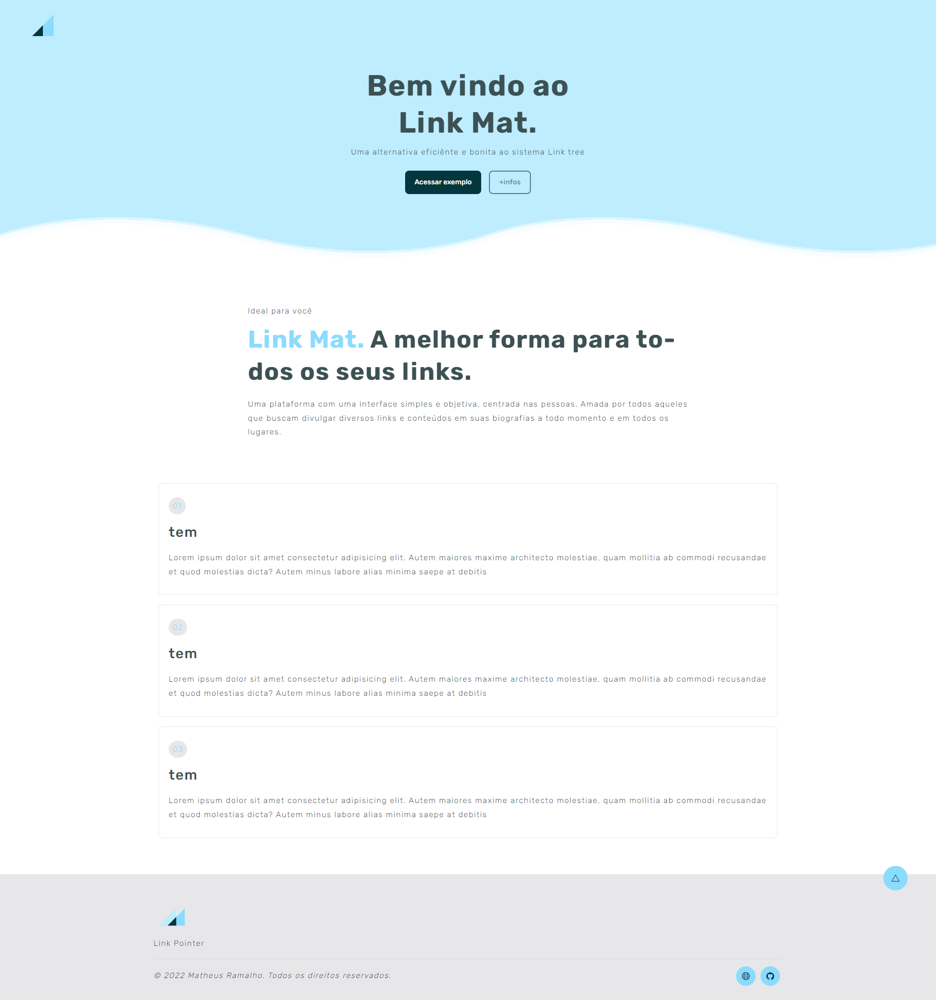

<p align="center">
    
</p>

<br>

---

<br>

## 🚀 Description

Front-end project designed for training, used as the basis of the LinkTree project, inspiration site, front developed with the intention of a more beautiful alternative to the other options available on the market.

<br>

## 🚀 Technologies

This project was developed using the following technologies:

- [Vite](https://vitejs.dev/)
- [ReactJs](https://reactjs.org/)
- [StyledComponents](https://styled-components.com/)

Run this command to install the dependencies.

```bash
yarn install

yarn dev
```

<br>

## 🔖 Layout

You can view the project through the links below:

- [Live Preview](https://myonix.vercel.app/)

<br>

## 📝 License

This project is licensed under the MIT License. See the [LICENSE](LICENSE) file for details.

<br>

---

Made with 💜 by [matheuramalho](https://www.matheusramalho.dev) ✌🏻